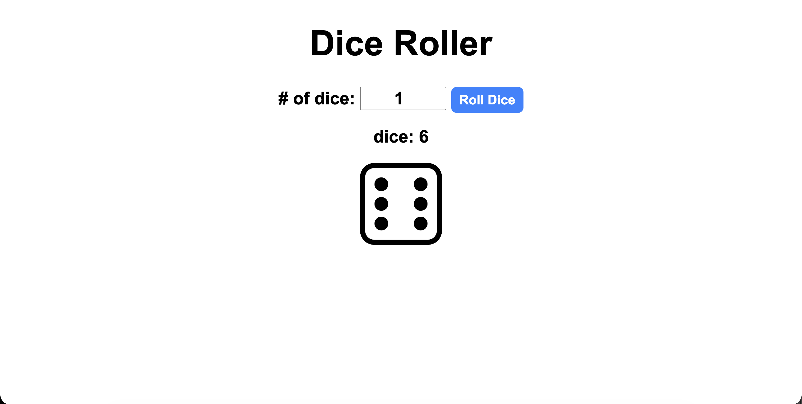

# Dice Roller

Piccola applicazione web per lanciare da 1 a 9 dadi e visualizzare sia i valori ottenuti sia le immagini corrispondenti.

## Funzionalità
- selezione del numero di dadi
- generazione casuale dei risultati
- visualizzazione dei valori estratti
- visualizzazione grafica dei dadi lanciati

## Tecnologie usate
- HTML
- JavaScript
- CSS

## Come usare il progetto
1. Clona o scarica il repository
2. Apri `index.html` nel browser
3. Scegli quanti dadi lanciare
4. Premi **Roll Dice**

## Struttura del progetto
- `index.html` → struttura della pagina
- `index.js` → logica del lancio dei dadi
- `index.css` → stile dell’interfaccia
- `dice_images/` → immagini dei dadi

## Note
Il progetto usa JavaScript per generare numeri casuali da 1 a 6 e mostrare il risultato nella pagina.

## Demo

